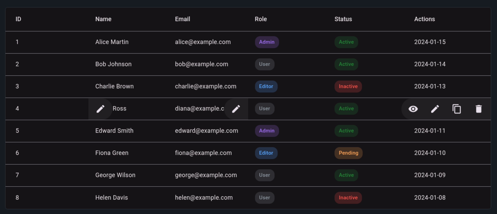

<p align="center">
  <a href="https://www.softwarity.io/">
    
  </a>
</p>

# @hhangular/row-actions

<p align="center">
  <a href="https://www.npmjs.com/package/@hhangular/row-actions">
    
  </a>
  <a href="https://github.com/hhangular/row-actions/blob/main/LICENSE">
    
  </a>
  <a href="https://github.com/hhangular/row-actions/actions/workflows/main.yml">
    
  </a>
</p>

An Angular component that displays a collapsible action toolbar when hovering over a `mat-table` row. The buttons appear with a smooth animation from the edge of the cell.

**[Live Demo](https://hhangular.github.io/row-actions/)** | **[Release Notes](RELEASE_NOTES.md)**

<p align="center">
  <a href="https://hhangular.github.io/row-actions/">
    
  </a>
</p>

## Features

- **Collapsible Toolbar** - Action buttons appear on row hover with smooth animation
- **Flexible Positioning** - Toolbar can appear from left or right depending on placement
- **Material 3 Ready** - Uses M3 design tokens for theming (`--mat-sys-primary`, etc.)
- **Standalone Component** - Easy to import in any Angular 17+ application
- **Lightweight** - No additional dependencies beyond Angular Material

## Installation

```bash
npm install @hhangular/row-actions
```

### Peer Dependencies

| Package | Version |
|---------|---------|
| @angular/common | >= 17.0.0 |
| @angular/core | >= 17.0.0 |
| @angular/cdk | >= 17.0.0 |
| @angular/material | >= 17.0.0 |
| @angular/animations | >= 17.0.0 |

## Usage

Import the standalone component in your component:

```typescript
import { RowActionComponent } from '@hhangular/row-actions';

@Component({
  selector: 'app-my-component',
  standalone: true,
  imports: [RowActionComponent],
  template: `...`
})
export class MyComponent {}
```

Add the `<row-actions>` component inside a `mat-cell`:

```html
<mat-table [dataSource]="dataSource">
  <!-- Other columns... -->

  <ng-container matColumnDef="actions">
    <mat-header-cell *matHeaderCellDef>Actions</mat-header-cell>
    <mat-cell *matCellDef="let element">
      {{ element.lastUpdated }}
      <row-actions>
        <button mat-icon-button (click)="edit(element)">
          <mat-icon>edit</mat-icon>
        </button>
        <button mat-icon-button (click)="delete(element)">
          <mat-icon>delete</mat-icon>
        </button>
      </row-actions>
    </mat-cell>
  </ng-container>

  <mat-header-row *matHeaderRowDef="displayedColumns"></mat-header-row>
  <mat-row *matRowDef="let row; columns: displayedColumns;"></mat-row>
</mat-table>
```

## API

### Inputs

| Input | Type | Default | Description |
|-------|------|---------|-------------|
| `disabled` | `boolean` | `false` | Disables the component (hides it completely) |
| `animationDisabled` | `boolean` | `false` | Disables the expansion animation (set at initialization only) |

### Position Behavior

The toolbar automatically detects its position within the cell and animates accordingly:
- **First child** in cell → Toolbar appears from the **left**
- **Last child** in cell → Toolbar appears from the **right**

You can place `<row-actions>` in **any cell** of your table, not just a dedicated "actions" column. This allows you to add contextual actions to specific data columns.

## Theming (Material 3)

The component uses Material 3 design tokens for theming. By default, it uses the `primary` color from your theme.

The toolbar automatically inherits colors from these CSS custom properties:
- `--mat-sys-primary` - Background color
- `--mat-sys-on-primary` - Text/icon color

To customize the colors, override these properties in your styles:

```css
/* Use secondary color */
row-actions mat-toolbar {
  background-color: var(--mat-sys-secondary);
  color: var(--mat-sys-on-secondary);
}

/* Use tertiary color */
row-actions mat-toolbar {
  background-color: var(--mat-sys-tertiary);
  color: var(--mat-sys-on-tertiary);
}

/* Use error color */
row-actions mat-toolbar {
  background-color: var(--mat-sys-error);
  color: var(--mat-sys-on-error);
}

/* Custom color */
row-actions mat-toolbar {
  background-color: #1976d2;
  color: white;
}
```

## Examples

### Basic Usage (Right-aligned)

```html
<mat-cell *matCellDef="let element">
  {{ element.name }}
  <row-actions>
    <button mat-icon-button><mat-icon>edit</mat-icon></button>
    <button mat-icon-button><mat-icon>delete</mat-icon></button>
  </row-actions>
</mat-cell>
```

### Left-aligned Toolbar

```html
<mat-cell *matCellDef="let element">
  <row-actions>
    <button mat-icon-button><mat-icon>edit</mat-icon></button>
    <button mat-icon-button><mat-icon>delete</mat-icon></button>
  </row-actions>
  {{ element.name }}
</mat-cell>
```

### Conditionally Disabled

```html
<row-actions [disabled]="!hasPermission">
  <button mat-icon-button><mat-icon>edit</mat-icon></button>
</row-actions>
```

## License

MIT
