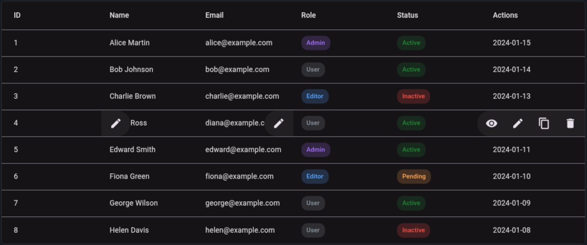

<p align="center">
  <a href="https://www.softwarity.io/">
    
  </a>
</p>

# @softwarity/row-actions

<p align="center">
  <a href="https://www.npmjs.com/package/@softwarity/row-actions">
    
  </a>
  <a href="https://github.com/softwarity/row-actions/blob/main/LICENSE">
    
  </a>
  <a href="https://github.com/softwarity/row-actions/actions/workflows/main.yml">
    
  </a>
</p>

An Angular component that displays a collapsible action toolbar when hovering over a `mat-table` row. The buttons appear with a smooth animation from the edge of the cell.

**[Live Demo](https://softwarity.github.io/row-actions/)** | **[Release Notes](RELEASE_NOTES.md)**

<p align="center">
  <a href="https://softwarity.github.io/row-actions/">
    
  </a>
</p>

## Features

- **Collapsible Toolbar** - Action buttons appear on row hover with smooth animation
- **Flexible Positioning** - Toolbar can appear from left or right depending on placement
- **Material 3 Ready** - Uses M3 design tokens for theming (`--mat-sys-primary`, etc.)
- **Standalone Component** - Easy to import in any Angular 17+ application
- **Lightweight** - No additional dependencies beyond Angular Material

## Installation

```bash
npm install @softwarity/row-actions
```

### Peer Dependencies

| Package | Version |
|---------|---------|
| @angular/common | >= 21.0.0 |
| @angular/core | >= 21.0.0 |
| @angular/cdk | >= 21.0.0 |
| @angular/material | >= 21.0.0 |

## Usage

Import the directive in your component:

```typescript
import { RowActionsDirective } from '@softwarity/row-actions';

@Component({
  selector: 'app-my-component',
  imports: [RowActionsDirective],
  template: `...`
})
export class MyComponent {}
```

Add the `rowActions` directive inside a `mat-cell`:

```html
<mat-table [dataSource]="dataSource">
  <!-- Other columns... -->

  <ng-container matColumnDef="actions">
    <mat-header-cell *matHeaderCellDef>Actions</mat-header-cell>
    <mat-cell *matCellDef="let element">
      {{ element.lastUpdated }}
      <span rowActions>
        <button matIconButton (click)="edit(element)">
          <mat-icon>edit</mat-icon>
        </button>
        <button matIconButton (click)="delete(element)">
          <mat-icon>delete</mat-icon>
        </button>
      </span>
    </mat-cell>
  </ng-container>

  <mat-header-row *matHeaderRowDef="displayedColumns"></mat-header-row>
  <mat-row *matRowDef="let row; columns: displayedColumns;"></mat-row>
</mat-table>
```

### Variants

The directive supports 3 visual variants:

```html
<!-- Default variant (surface-container) -->
<span rowActions>...</span>

<!-- Filled variant (primary-container) -->
<span rowActions="filled">...</span>

<!-- Tonal variant (secondary-container) -->
<span rowActions="tonal">...</span>
```

## API

### Inputs

| Input | Type | Default | Description |
|-------|------|---------|-------------|
| `disabled` | `boolean` | `false` | Disables the component (hides it completely) |
| `closeOnClick` | `boolean` | `true` | Closes every toolbar when the row is clicked — a row click usually opens a drawer or navigates, and no toolbar should stay floating above it. Set to `false` to keep the toolbar open. |

### Methods

| Method | Description |
|--------|-------------|
| `close()` | Immediately closes this toolbar and cancels any pending open. |
| `RowActionsDirective.closeAll()` <sub>static</sub> | Closes every toolbar on the page. Call it when a row click opens a drawer or dialog, so no toolbar stays floating above the overlay. |

```typescript
import { RowActionsDirective } from '@softwarity/row-actions';

protected onRowClick(row: Row): void {
  RowActionsDirective.closeAll(); // no toolbar left hovering over the drawer
  this.openDrawer(row);
}
```

### Position Behavior

The toolbar automatically detects its position within the cell and animates accordingly:
- **First child** in cell → Toolbar appears from the **left**
- **Last child** in cell → Toolbar appears from the **right**

You can place `<span rowActions>` in **any cell** of your table, not just a dedicated "actions" column. This allows you to add contextual actions to specific data columns.

### Scroll Behavior

Any scroll — the page or a scrollable container around the table — closes every open toolbar. Scrolling slides the row out from under the cursor without firing a single `mousemove`, so a toolbar left open would stay attached to a row the user is no longer pointing at, and an action would hit the wrong one. The toolbar reopens on the correct row as soon as the mouse moves again.

## Theming (Material 3)

The component provides a SCSS mixin to customize the toolbar colors. This approach follows Angular Material's theming pattern.

### Setup

In your application's `styles.scss`, import the theme file and call the `overrides` mixin:

```scss
@use '@angular/material' as mat;
@use '@softwarity/row-actions/row-actions-theme' as row-actions;

// Your Material 3 theme
html {
  @include mat.theme((
    color: (
      primary: mat.$violet-palette,
      tertiary: mat.$yellow-palette
    ),
    typography: Roboto,
    density: 0
  ));
}

// Optional: customize row actions colors
// @include row-actions.overrides();
```

### Customization

The `overrides` mixin accepts a map of tokens to customize the toolbar appearance for each variant:

| Token | Default | Description |
|-------|---------|-------------|
| `container-background-color` | `var(--mat-sys-surface-container)` | Background for default variant |
| `filled-background-color` | `var(--mat-sys-primary-container)` | Background for filled variant |
| `tonal-background-color` | `var(--mat-sys-secondary-container)` | Background for tonal variant |

### Examples

```scss
// Customize all variants with light/dark support
@include row-actions.overrides((
  container-background-color: light-dark(#e8def8, #4a4458),
  filled-background-color: light-dark(#d0bcff, #381e72),
  tonal-background-color: light-dark(#e8def8, #4a4458)
));

// Use Material 3 system colors
@include row-actions.overrides((
  container-background-color: var(--mat-sys-tertiary-container)
));

// Custom color for default variant only
@include row-actions.overrides((
  container-background-color: #1976d2
));
```

To customize the icon buttons, use Angular Material's `matIconButton` overrides directly.

## Examples

### Basic Usage (Right-aligned)

```html
<mat-cell *matCellDef="let element">
  {{ element.name }}
  <span rowActions>
    <button matIconButton><mat-icon>edit</mat-icon></button>
    <button matIconButton><mat-icon>delete</mat-icon></button>
  </span>
</mat-cell>
```

### Left-aligned Toolbar

```html
<mat-cell *matCellDef="let element">
  <span rowActions>
    <button matIconButton><mat-icon>edit</mat-icon></button>
    <button matIconButton><mat-icon>delete</mat-icon></button>
  </span>
  {{ element.name }}
</mat-cell>
```

### Conditionally Disabled

```html
<span rowActions [disabled]="!hasPermission">
  <button matIconButton><mat-icon>edit</mat-icon></button>
</span>
```

## License

Apache-2.0
